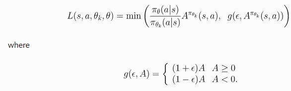

<h1>Video</h1>
<iframe width="560" height="315" src="https://www.youtube.com/embed/o4R8wv21cOA" frameborder="0" allow="accelerometer; autoplay; clipboard-write; encrypted-media; gyroscope; picture-in-picture" allowfullscreen></iframe>

<h2>Project Summary:</h2>
Flying any object at a low altitude is one of the most challenging tasks in both real life and in Minecraft. There’s less time to react, can’t move or see as far and there’s a higher chance of crashing. For this reason, an AI is required to navigate low-flying agents by using object recognition and movement.

Our Zoomer Project is an AI that uses Reinforcement Learning to guide a Minecraft Agent through a randomly generated course using the flight mechanics of the Elytra. The goal of the project is to have our agent fly through the obstacle course in the fastest and safest manner possible. Using the Proximal Policy Optimization (PPO) algorithm from RLlib and Malmo, we take a 31x31x31 observation space, the line of sight, and the agent’s y and z position as input. The agent then returns a pitch, turn and use command as an action. The agent’s reward is based on the progress it makes through the course, the number of obstacles it hits and whether it makes it to the end or not. As a result, our Agent learns when to boost itself, what objects to avoid, and what objects to aim for during flight.

<h2>Approach:</h2>
In our project, the primary machine learning/artificial intelligence algorithm we use is reinforcement learning. Using the “rllib” library, we give it the pytorch framework as a primary way to learn. In order for reinforcement learning to work properly, we created an observation space capturing every block within the nearest 31x31x31 region. At this step, we were debating on whether to use computer vision in order to capture a video recording of what is in front of the agent or use the built in observation space by Malmo XML. After doing some research, we figured out that using computer vision was a lot more GPU intensive most of our group did not have the proper GPU’s to handle computer vision effectively and efficiently. So although computer vision may have been a little bit more effective since the agent would learn off of red, green, and blue pixel values instead of actual blocks, this would also take a much longer time to process on our computers. So, using the observation space, we then send what type of blocks are close by so that our agent can learn to avoid these obstacles instead of crashing. Furthermore, we use the line of sight variable from the Malmo XML documentation to see which obstacles are right in front of the agent. With the line of sight, we make sure our agent will move immediately if there is wool (the obstacle) nearby.

When creating the obstacle course, we originally had a simple course where only horizontal blocks formed at random points every 15 blocks across a 100 block course. This course was much simpler and led to higher rewards. Our agent performed better and took much less time to train. However, we decided to make our obstacle course more complicated and create diagonal, vertical, and horizontal blocks more frequently across a 175 block course. Although this performed worse due to taking a longer time to train, we realized our agent would learn more from this complicated course over time and could perform better in different scenarios. Below, a simple and complicated obstacle course are shown.

When handling the type of movement, we were unsure if we should use discrete movement or continuous movement. Originally, we tried to use
discrete movement since continuous movement did not perform well over 10,000 steps. With discrete movement, we knew our agent would require much less data to learn from, and overall perform better. However, we noticed that with discrete movement, the agent would make sharp turns left or right, which was not what we wanted since our agent needed to move in a more or less straight motion. So, we decided to use continuous movement for our agent in order to give the agent more maneuverability and fluidity to avoid obstacles. With continuous movement, our action space includes “pitch”, “turn”, and “use”. By including “pitch” as one of the actions, our agent will be able to immediately move down or up if there is an obstacle in front of it. Similarly, by including “turn” in our actions, our agent will be able to turn away from the obstacle (most of the time, these obstacles include the walls), and not crash. Lastly, we include “use” as one of our actions so our agent can decide when to use the fireworks and boost itself forward over obstacles. 
With both types of approaches, we decided to use the Proximal Policy Optimization algorithm from Rllib and Malmo. This algorithm is defined by the following equation: 

Finally, it is important to add negative rewards if the agent doesn’t perform properly in order to discourage further similar actions. So, we decided to add a negative reward of -50 for touching lava and -10 for touching wool. Since lava causes the agent to immediately die, we added a high negative reward for it so the agent learns not to touch it. Originally, with just these negative rewards, we noticed that our agent started to learn to “hug” the ceiling or walls in order to avoid obstacles the majority of the time. While this motion did lead to positive rewards and performed better, we did not want our agent to behave like this. So we decided to add a -50 reward for touching glass (the ceiling) and obsidian (the walls). We want our agent to steadily be in the center of the course with occasional movements to the side, up, and down. As a result, we added a lower negative reward for touching wool (the obstacle block), so the agent would learn to avoid it but not go all the way to the edge or top. Since the obstacle course is 175 blocks long and negative rewards can add up quickly, we decided to add a positive reward of +1000 for reaching the end of the course. This reward will outweigh the negative rewards and teach the agent that reaching the end of the course is beneficial. Additionally, we added a reward of +7.5 for moving forward for each block across the 175 block range. This reward should teach the agent that getting further in the course will also be beneficial.

<h2>Evaluation:</h2>
<h4>Quantitative Evaluation:</h4>
For our quantitative evaluation, we decided to use the reward counter that would give us an overview of how the agent was performing over a certain period of time, including using saved reinforcement learning data from previous runs (See Figure Z-2 that uses the learned data from Figure Z-1 to resume running). 
Here you can see that the agent is in fact learning (it is not acheiving the same amount of negative reward as it had been in the beginning).
The data is not trending as upwards as we hoped it would into the positives but because we are using continuous action that is somewhat expected. Nonetheless, there is an undeniable upward trend in terms of less negative reward being achieved later on in the graph, and we see a little less volatility towards the extreme negative values. Based off of the current upwards trend, we predict that if we run it for an even longer amount of time, we would see better upward trending results. 

<caption>Figure Z-1</caption>

<caption>Figure Z-2</caption>

<h4>Qualitative Evaluation:</h4>
For our qualitative evaluation, we are analyzing the response time the agent has to see an object and perform an action. Based on this, we are able to determine if the agent is reacting to objects the way we want it to. In Video ZV-1 you can see that the agent is still learning through reinforcement learning, it doesn't quite make it to the goal but it now has more data that it can use to determine what it should do next time. In Videos ZV-2 and ZV-3, you can get an idea of what our agent's baseline performance is like after it has learned with the PPO algorithm a little more and is starting to make less mistakes but still either hits obstacles or struggles to reach the goal. In Video ZV-4, the agent reaches the goal redstone wall with relatively no errors and and through our observation, we know it received a higher reward value than usual. Although sometimes the rewards aren't as high as we would like them, the video results prove to us that the agent is in fact learning and achieving it's goal a lot more often towards the end. 

<caption>Video ZV-1</caption>

<h4>Baseline Performance:</h4>

<caption>Video ZV-2</caption>

<caption>Video ZV-3</caption>

<h4>Best Performance:</h4>

<caption>Video ZV-4</caption>

<h2>References/Resources Used:</h2>
We based our initial reinforcement learning approach/implementation on that provided to us in Assignment #2 (which uses the library “rllib”), which we modified to work with our project. We used the XML Schema and Project Malmo code documentation to help with writing our code. 

Additionally, we used the “pyautogui” and “pygetwindow” libraries to activate the elytra as Malmo could not send the jump output long enough for the wings to activate.

1. [pyautogui](https://pyautogui.readthedocs.io/en/latest/)
2. [pygetwindow](https://pypi.org/project/PyGetWindow/)

