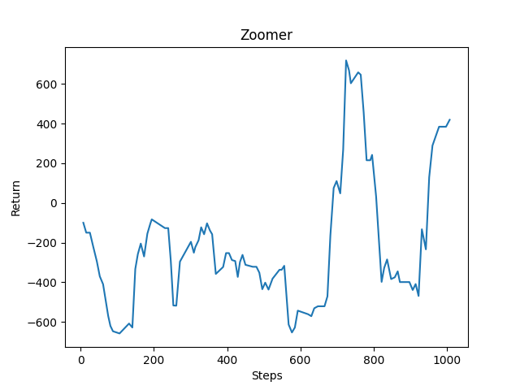
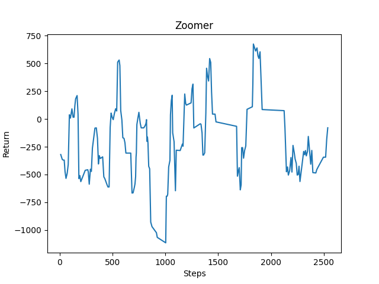

<h1>Video</h1>

<h2>Project Summary:</h2>
In our Zoomer project, we plan to use an AI to guide our agent through a course of randomly generated obstacles through the use of elytra to glide/fly through the course. We will train the agent reinforcement learning the Proximal Policy Optimization algorithm under RLlib. We will also use certain rules to correct the behavior of the agent to ensure that it is always going forward. For our input, we use a 5 x 5 observation grid and the line of sight of the agent to determine the blocks around and in front of it. We will then use the pitch and turn generated by the PPO algorithm to determine how the agent will react to the stimuli. For our current progress, we used a 100 block long obstacle course made out of obsidian, lava, and glass with obstacles generated every 15 blocks made out of blue wool. When the agent reaches the redstone blocks at the end, it will restart the mission and keep improving. Our goal is to make the agent go through the obstacle course without touching any edge nor obstacle as fast as possible. From there, we plan to use different methods of input gathering, make a variety of obstacles, and improve the AI to eventually make it through longer courses.

<h2>Approach:</h2>
In our project, the primary machine learning/artificial intelligence algorithm we use is Proximal Policy Optimization. Using the “rllib” library, we give it the pytorch framework as a primary way to learn. For our input, we created an observation space capturing every block within the nearest 5x2x5 region and a line of sight. Using the observation space, we then send what type of blocks are in the immediate line of sight so that our agent can learn to avoid these obstacles instead of crashing. Using the line of sight, we make sure our agent will move immediately if there is lava, obsidian (the wall), glass (the ceiling), or wool (the obstacle) nearby. 

We decided to use continuous movement for our agent in order to give the agent more maneuverability and fluidity to avoid obstacles. With continuous movement, our action space includes “pitch”, “turn”, and “use”. By including “pitch” as one of the actions, our agent will be able to immediately move down or up if there is an obstacle in front of it. Similarly, by including “turn” in our actions, our agent will be able to turn away from the obstacle (most of the time, these obstacles include the walls), and not crash. Lastly, we include “use” as one of our actions so our agent can decide when to use the fireworks and boost itself forward over obstacles. However, to make ensure that "use" was working properly, we modified the minecraft client by swapping the "use" and "attack" buttons so that the agent is able to use the rockets. We also gave our agent diamond armor with protection IV and unbreaking III to prevent the agent from immediately dying when it reaches the redstone goal blocks or any obstacle/edge.

Finally, it is important to add rewards to discourage or encourage the agent from certain behaviors. First, we decided to add a negative reward of -50 for touching lava, obsidian, glass, and -10 for touching wool. Since lava causes the agent to immediately die, we added a high negative reward for it so the agent learns not to touch it. Meanwhile, we added a high negative reward for obsidian (the walls) and glass (the ceilings) so the agent will not “hug” these blocks in order to get across the obstacle course, as seen during some of the earlier training sessions. We want our agent to steadily be in the center of the course with occasional movements to the side, up, and down for maximum maneuverability. As a result, we added a lower negative reward for touching wool (the obstacle block), so the agent would learn to avoid it but not go all the way to the edge or top. We also added a cuboid of reward checkpoints immediately behind the obstacles to encourage the agent to move forward. However, since each individual block in the cuboid gives a reward, to prevent the agent from abusing the checkpoints for rewards we gave it a +1 reward. This is why the other rewards are extremely high. Since the obstacle course is 100 blocks long, the negative rewards can add up quickly. In response we added a very large positive reward of +1000 for reaching the end of the course. This reward will outweigh the negative rewards and teach the agent that reaching the end of the course is beneficial.

<h2>Evaluation:</h2>
For our quantitative evaluation, we decided to use the reward counter since that would give us an overview of how the agent was performing over a certain period of time. Currently, we have a working agent that gets to the end of the obstacle course occasionally, but dies other times. Below, you can see two graphs highlighting the reward improvement over the course of 1000 steps and over the course of 2500 steps. While the agent tends to have negative rewards sometimes, we can already see an upward trend leading towards the positive side. Once we start training the agent for longer periods of time, we can expect to see a more stable positive reward.

For our qualitative evaluation, we are analyzing the response time the agent has to see an object and perform an action. Based on this, we are able to determine if the agent is reacting to objects the way we want it to. In the first video below, you can see the agent crashing immediately into the lava. In the second video, after changing the pitch, our agent was able to react more positively to the obstacles by avoiding them.

<h2>Remaining Goals and Challenges:</h2>

<h4>Remaining Goals:</h4>
So far we have developed the base for our AI, however we need to do a lot to improve the performance and effiency of the AI. Moving forward, we need to reevaluate how we train the AI to generate results faster. Even though the AI can successfully get through the basic obstacle course, we do not save the results every time, which leads to retraining it everytime we want to run it. The AI also continues to run into lava and gets stuck in certain patterns if the generation is extremely similar. We also need to better control on when to use the boosts for the AI, as it continues to ram against obstacles.

For the next few weeks, we will be experimenting with different ways to gather input to create more proactive movement compared to the reactive movement we have now. We plan to use video recording and a depth map recognize obstacles and walls in order to move the pitch and turn of the agent to the area of most depth. The reason for this change is that currently, we use only line of sight and a tight 5x5 observation grid to move out of the way. Since we move fast, the observation grid might not be able to capture the blocks in time, or we could turn too late due to our velocity. 

We also plan to create a more complex, longer obstacle course to be generated as the agent gets faster and more efficient. We will add a variety of obstacles such as vertical and diagonal lines. We would like to add moving obstacles as well, however there is no mechanism for that at the moment. We will also use this more complex obstacle course to reevaluate our current methods.

<h4>Challenges:</h4>
From our experience so far, we have had some trouble ensuring that the agent stays alive when it reaches the redstone wall. During some runs, the agent will smack the redstone wall or obstacle at an extremely high velocity, causing it to die on impact. While it still receives the reward and improved performance, the agent still technically fails as it dies during mid-flight. Our current solution to this problem is to use diamond armor with Protection IV and Unbreaking III. Although this does help a bit, it does not solve the issue entirely due to multiple impacts causing a large amount of damage. Moving forward we will try to use a rule for boosting to prevent high velocities.

We also had trouble using the malmo agent for some of the functions surrounding elytra. Currently, we have to use two third party libraries: "pyautogui" and "pygetwindow", which only works on Windows, to force the program to hold the space bar to activate the elytra on flight. This only happens at the beginning of each mission and so it does not compromise the rest of the AI. Although it works for now, we will try to find another way to get the elytra to fly without using these libraries.

In terms of item generation, we also had trouble getting the items to spawn with the correct properties (i.e. fireworks with Flight Duration I) using only the XML. As a workaround, we used the console commands to spawn the items (such as armor, firework rockets) before the mission begins. However the only drawback to this is that the screen has a black block at the start. Moving forward, we will try to ensure that the XML can generate these items without using console commands.

Because the way the checkpoints are generated, as a wall of PointWithRewards, the agent is sometimes motivated to move upwards into the stack of rewards as opposed to across them to reach the end goal. This problem doesn’t seem to be as much of an issue after spending some time considering/testing different reward values. We will continue to test different reward values to determine the best for us or possibly consider an approach without checkpoints. 

<h2>Resources Used:</h2>
We based our initial reinforcement learning approach/implementation on that provided to us in Assignment #2 (which uses the library “rllib”), which we modified to work with our project. We used the XML Schema and Project Malmo code documentation to help with writing our code. 

Additionally, we used the “pyautogui” and “pygetwindow” libraries to activate the elytra as Malmo could not send the jump output long enough for the wings to activate. 
pyautogui: <a href="url">"https://pyautogui.readthedocs.io/en/latest/"</a> 
pygetwindow: <a href="url">"https://pypi.org/project/PyGetWindow/"</a>

